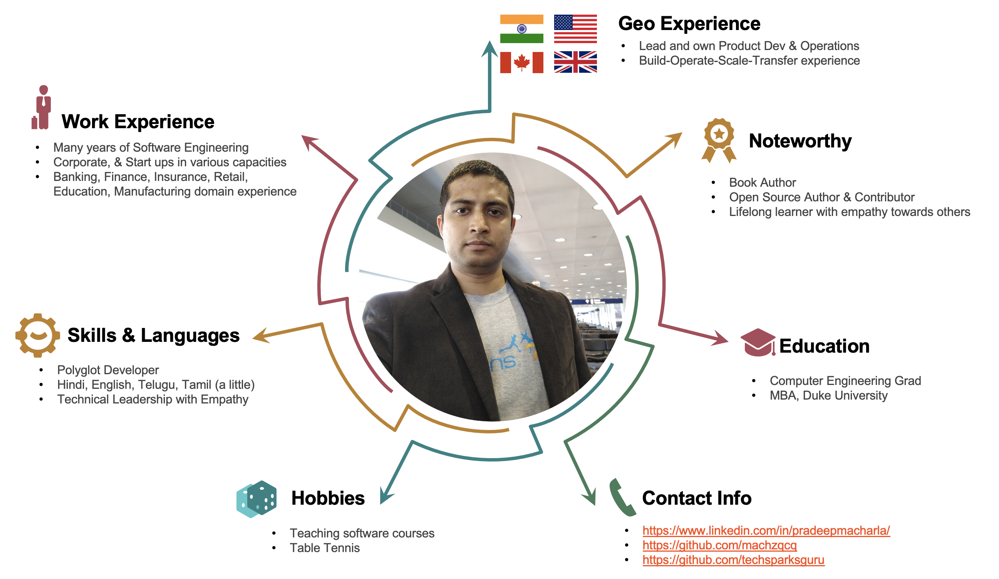

### hey there  

#### TL;DR: I am [Pradeep](https://www.linkedin.com/in/pradeepmacharla/), an entrepreneur, investor, innovator, leader, manager....*Titles are in the eyes of beholder*  

 |   |  |  |

***

***
   
I am able to zoom-in and get into details, at the same time zoom-out and step back to see the big picture as the situation demands. I have led, built and maintained software systems on the web at various scalability levels. I am humbled at the pace of technology advances and eager to learn as much as I can.

  
- 💼 any freelance work? do reach, [email](mailto:pradeep@seleniumframework.com)
- 💬 I have executed large scale projects and respect your time, as you would do the same
- `$$` I have invested in couple of software projects using my weekend time. So if you have the right idea and enthusiasm, lets partner up and talk equity

***
## Capabilities
-  Leadership with Empathy (People and Technical)
-  Software & Data Engineering

***

 